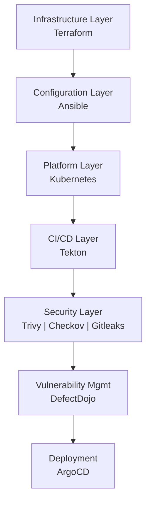
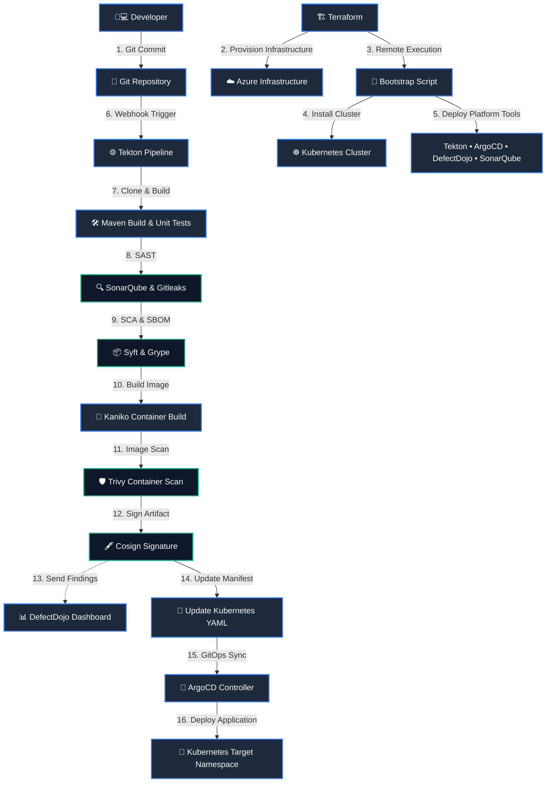
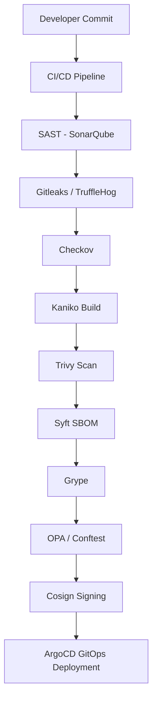

> A comprehensive technical guide to designing, building, and automating a secure cloud-native DevSecOps platform with Terraform, Ansible, Tekton, ArgoCD, and centralized vulnerability management.

This guide demonstrates how to architect an enterprise-grade **DevSecOps platform** from the ground up, moving beyond traditional CI/CD pipelines to embrace declarative GitOps and policy-as-code. By marrying **Terraform (IaC)**, **Ansible (Configuration Management)**, **Tekton (CI/CD)**, and **ArgoCD (GitOps)**, you will learn how to create a pipeline that builds and tests securely without hindering deployment speed.

---

## ✨ Overview

In the modern landscape of software engineering, velocity is paramount. However, traditional CI/CD (Continuous Integration and Continuous Deployment) pipelines frequently stumble when it comes to security. Historically, security evaluations occur late in the software development lifecycle (SDLC), acting as a massive bottleneck right before a deployment to production. Finding a critical vulnerability at that stage is expensive, delays releases, and fuels friction between development and security teams.

The paradigm shift solving this is **DevSecOps**, anchored perfectly by the philosophy of **Shift-Left Security**. "Shifting left" means embedding automated compliance testing, secret scanning, and vulnerability detection as closely to the developer's native workflow as possible. Rather than waiting weeks, developers get feedback in minutes.

The cornerstone of a successful shift-left approach is **immutable automation**. An effective platform must rely on **Infrastructure as Code (IaC)** and Configuration Management to ensure zero configuration drift. Every layer of the platform, from network firewalls to Kubernetes cluster provisioning, must be versioned, trackable, and instantly reproducible.

This comprehensive technical guide demonstrates how to architect an enterprise-grade DevSecOps platform from the ground up. By marrying Terraform (IaC), Ansible (Configuration Management), Tekton (CI/CD), ArgoCD (GitOps), and a suite of premier scanning operators, you will learn how to create a fortress-like pipeline that builds and tests securely without hindering deployment speed.


> Figure — Bootstrapped Unified DevSecOps Platform Portal

---

## 📈 DevSecOps Maturity Model

Organizations typically evolve through multiple stages when adopting DevSecOps.

| Stage | Description |
|------|-------------|
| Traditional CI/CD | Security performed manually after deployment |
| Automated CI/CD | Pipelines build and test automatically |
| DevSecOps | Security scanning integrated into CI/CD |
| Policy-as-Code | Governance enforced automatically with OPA |
| GitOps Security | Secure deployments managed declaratively |

This platform demonstrates the **final two stages** by integrating:

- Policy-as-Code with **OPA and Conftest**
- GitOps deployments using **ArgoCD**
- Security gates enforced during pipeline execution.

---

## 🏗️ Platform Stack Diagram



---

## 🆕 Platform Evolution

Since the inception of this platform architecture, our repository has scaled to embrace a much more profound level of modularity. Below are the architectural changes driving our newest iteration:

*  **Ansible Configuration Automation:** We explicitly decoupled the heavy lifting of `bootstrap.sh` into structured Ansible roles. Installing Kubernetes, configuring NFS limits, and standing up external services are now executed idempotently via Ansible Playbooks.

*  **DockerHub Integration:** Native variables (`dockerhub_username`, `dockerhub_token`) are deeply integrated into the state files. Kaniko leverages these credentials to harness remote registry caching and push final container manifests natively.

*  **Slack Webhook Alerts:** We introduced real-time notifications via `slack_webhook_url`, firing alerts back to developer channels automatically when pipelines either clear gates or fail critical checks.

*  **Streamlined Pipeline Execution:** The primary pipeline execution file is now condensed and optimized into `Full_tek.yaml`. This pipeline completely shifts away from offline tarballs and instead utilizes direct remote registry authentication for building SBOMs and signing images via Cosign.

---

## 🛠️ Stack Overview

To implement a frictionless and secure pipeline, we specifically chose best-of-breed open-source operators tightly coupled with Kubernetes.

| Component | Tool / Platform | Purpose |
| :--- | :--- | :--- |
| **IaC** | **Terraform** | Builds the immutable cloud layer (VMs, Networking, Security Groups). |
| **Config Mgmt** | **Ansible** | Orchestrates cluster creation, applying roles idempotently over SSH. |
| **Orchestration** | **Kubernetes** | The localized execution cluster hosting our runtime and pipelines. |
| **CI/CD Native** | **Tekton** | Serverless pipeline execution; spins up discrete Pods per pipeline task. |
| **Code Quality** | **SonarQube** | Establishes SAST (Static Application Security Testing) and code smell tracking. |
| **Secret Scanning**| **Gitleaks** | Analyzes filesystems ensuring zero hardcoded credentials reach the registry. |
| **IaC Scanning** | **Checkov** | Evaluates Terraform and Kubernetes YAML against global CIS baselines. |
| **Container Build**| **Kaniko** | Constructs Dockerfiles natively inside Kubernetes absolutely daemonless. |
| **SCA / SBOM** | **Syft & Grype** | Autogenerates Software Bill of Materials (SBOM) and detects CVE library flaws. |
| **Container Scan**| **Trivy** | Performs robust vulnerability checks strictly on the published Docker layers. |
| **Provenance** | **Cosign** | Cryptographically signs the generated image, enabling verifiable origins. |
| **Vuln Platform**| **DefectDojo** | Aggregates logs (SARIF, JSON) into a single, comprehensive management pane. |
| **Continuous Del**| **ArgoCD** | Applies GitOps logic to pull successful, signed artifacts into the target namespace. |

---

## 🧱 DevSecOps Architecture

The logic flow functions like a tightly guarded relay race. Execution is automatically handed off across isolated structural operators:

1.  **Developer to Git:** A code push to our source repository triggers an external execution webhook.
2.  **Terraform to Cloud Infrastructure:** Instantiates robust Azure boundaries (Virtual Networks, VMs, NSGs).
3.  **VM to Ansible Configuration:** The VM automatically triggers a bootstrap invocation mapping to Ansible playbooks (`bootstrap.yml`), defining Kubernetes entirely natively.
4.  **Tekton CI/CD Pipeline:** The execution spins up `Full_tek.yaml`, parsing through testing, compilation, and security scanning nodes natively on the newly generated cluster.
5.  **Security Scanning Tasks:** Tasks dynamically assess the code against Gitleaks, Checkov, Trivy, and Grype thresholds. Any severe CVE automatically kills the pipeline.
6.  **DefectDojo Defect Tracking:** Data from scanners uploads immediately into the dashboard acting as a definitive source of truth across the CI/CD execution run.
7.  **ArgoCD GitOps deployment:** Reconciles the Git manifests. ArgoCD identifies that a pipeline successfully finished, automatically pulling the updated and verified image into the underlying namespace seamlessly.



**Figure — End-to-End DevSecOps Platform Architecture**

This diagram illustrates the full lifecycle from infrastructure provisioning with Terraform to GitOps deployment via ArgoCD.


---

## 🧩 Prerequisites

To follow this tutorial and build this DevSecOps platform yourself, you will need a comfortable understanding of Linux operating systems, networking fundamentals, and bash scripting. You will also require specific tooling installed locally on your workstation.

### **Local Tooling Requirements:**

*  **Terraform CLI**: (`v1.6` or greater) for provisioning resources.
*  **Kubernetes Tooling**: `kubectl` for interacting with the bootstrapped cluster.
*  **Helm**: To interact with and customize cluster package definitions.
*  **Tekton CLI (`tkn`)**: For inspecting pipelines, tasks, and triggering pipeline runs locally.
*  **ArgoCD CLI**: For logging into the Argo server and managing Application sync states manually if required.
*  **Docker/Git**: Essential version control and container runtime semantics.

### **Cloud Infrastructure Limitations:**

Because of the heavy footprint of running Jenkins, SonarQube, DefectDojo, Java compilation, and Kubernetes components on a single cluster, you must provision an appropriately sized virtual machine.

*  **Cloud Provider:** Tested securely on Microsoft Azure.
*  **VM Sizing:** A minimum of 4 vCPUs and 16 GB of RAM is strictly required (e.g., Azure `Standard_E4ds_v4`). Attempting to deploy this on a smaller footprint will result in Out-Of-Memory (OOM) pod evictions.
*  **Operating System:** Ubuntu 24.04 LTS natively supports the necessary `kubeadm` container runtimes without interference.

---

## ⚙️ Environment Configuration

Security demands that sensitive platform keys reside far away from Git version control. Our cloud architecture injects variables strictly at the moment of execution.

### **.env Variables**

While local tests may use a static `.env` file, our Kubernetes bootstrapping injects credentials purely via the Linux terminal or CI variables layer utilizing secure overrides. During Terraform execution, dynamic credentials are passed directly into the remote server natively:

```bash
# Secure environments prevent committing API secrets
DEFECTDOJO_ADMIN_PASS="Generated_By_Terraform_Over_SSH"
SONARQUBE_ADMIN_PASS="Generated_By_Terraform_Over_SSH"
NIP_IP="Auto_Detected_Via_Curl"
```

By ensuring these values are injected directly into Helm deployments (like DefectDojo and SonarQube) exclusively from the terminal execution runtime, they never persist in `git`.

### **terraform.tfvars**

To dictate the structural footprint of our cloud, we rely heavily on `terraform.tfvars`. This file adapts the environment to the user, overwriting the default placeholder configurations established within `variables.tf`.

```hcl
# Example terraform.tfvars payload dictating the environment state
vm_name = "devsecops-platform"
admin_username = "hossam"
location = "switzerlandnorth"
dockerhub_username = "hossamibraheem"
dockerhub_repository = "hossamibraheem/devsecops"
git_username = "0x70ssAM"
```

Any variables defined with `sensitive = true` in the module (like `git_token`) must be provided explicitly at run-time, preventing unauthorized leakage into the `terraform.tfstate`.

---

## 📋 Pipeline Configuration

The strength of this system relies exclusively on deep configuration definitions. Our platform operates via three main components: The Terraform infrastructure, the Bash bootstrapping logic, and the Tekton YAML pipeline.

Let's explore the core repositories and real code snippets running this deployment.

---

### **1. Infrastructure Provisioning (Terraform)**

It all begins with Infrastructure as Code. Through our `main.tf` logic, we lock down cloud availability strictly to necessary dev parameters, utilizing Azure native components.

We generate network firewalls blocking unnecessary traffic, while defining dynamic root passwords automatically to sidestep human error:

```hcl
############################################
# Dynamic Platform Passwords
############################################
resource "random_password" "defectdojo_admin" {
  length = 24
  special = true
  override_special = "!@#$%"
}

############################################
# NSG Rule Injection
############################################
resource "azurerm_network_security_rule" "inbound_rules" {
  for_each = {
    for idx, port in local.inbound_ports :
    port => idx
  }
  name = "port-${each.key}"
  priority = 100 + each.value
  direction = "Inbound"
  access = "Allow"
  protocol = "Tcp"
  destination_port_range = each.key
  source_address_prefix = var.allowed_ip_cidr
  destination_address_prefix = "*"
  resource_group_name = azurerm_resource_group.rg.name
  network_security_group_name = azurerm_network_security_group.nsg.name
}
```

```terraform
# Define the core virtual machine
resource "azurerm_linux_virtual_machine" "vm" {
  name = var.vm_name
  location = azurerm_resource_group.rg.location
  resource_group_name = azurerm_resource_group.rg.name
  size = "Standard_E4ds_v4"
  admin_username = var.admin_username
  admin_password = var.admin_password
  disable_password_authentication = false
  network_interface_ids = [
    azurerm_network_interface.nic.id
  ]
  os_disk {
    caching = "ReadWrite"
    storage_account_type = "Premium_LRS"
  }
  source_image_reference {
    publisher = "Canonical"
    offer = "ubuntu-24_04-lts"
    sku = "server"
    version = "latest"
  }
}

# The remote-exec bridge transitioning from IaC to Kubernetes Bootstrapping
resource "null_resource" "bootstrap" {
  depends_on = [azurerm_linux_virtual_machine.vm]
  connection {
    type = "ssh"
    host = azurerm_public_ip.pip.ip_address
    user = var.admin_username
    password = var.admin_password
    timeout = "5m"
  }
  provisioner "file" {
    source = "bootstrap.sh"
    destination = "/tmp/bootstrap.sh"
  }
  provisioner "file" {
    source = "Tekton/Full_tek.yaml"
    destination = "/tmp/Full_tek.yaml"
  }
  provisioner "remote-exec" {
    inline = [
      "chmod +x /tmp/bootstrap.sh",
      # Dynamically inject highly secure random passwords as env variables!
      "sudo DEFECTDOJO_ADMIN_PASS='${random_password.defectdojo_admin.result}' SONARQUBE_ADMIN_PASS='${random_password.sonarqube_admin.result}' bash /tmp/bootstrap.sh",
      "kubectl apply -f /tmp/Full_tek.yaml"
    ]
  }
}
```

Once defined, Terraform effortlessly executes its `remote-exec` bindings. It SSH's into the server, drops the exact bash scripts, interpolates the generated `defectdojo_admin` and `sonarqube_admin` parameters, and triggers the `bootstrap.sh`.


> Figure — Terraform Output showing standard resource creation finishing with ssh remote code execution completion

---

### **2. Platform Bootstrapping (bootstrap.sh)**

The `bootstrap.sh` file bridges the gap between a raw Ubuntu Server and a complex Kubernetes DevSecOps cluster. Once Terraform triggers the execution, the script runs unattended.

It handles:
1. Disabling system swap.
2. Installing container runtimes (`containerd`).
3. Preparing keys, repositories, and downloading `kubeadm`, `kubectl`, and `kubelet`.

Inside `bootstrap.sh`, we handle crucial environment preparation:

```bash
log  "Installing Base Components"
sudo  apt-get  update  -y
sudo  apt-get  install  -y  sshpass  curl  wget  git  jq  software-properties-common

log  "Disabling Swap Memory (Required natively by Kubernetes)"
swapoff  -a || true
sed  -i  '/swap/d'  /etc/fstab || true

########################################
# Triggering Automation Handoff
########################################
# Our platform transitions control actively utilizing Ansible for deeper orchestration mappings
```

Here is the exact cluster initialization sequence found in our codebase:

```bash
########################################
# Kubernetes Environment Initialization
########################################
log  "Installing Kubernetes"

# Add signing keys for the repository
mkdir  -p  /etc/apt/keyrings
curl  -fsSL  https://pkgs.k8s.io/core:/stable:/v1.35/deb/Release.key  \
| gpg  --dearmor  -o  /etc/apt/keyrings/kubernetes-apt-keyring.gpg

echo  "deb [signed-by=/etc/apt/keyrings/kubernetes-apt-keyring.gpg] https://pkgs.k8s.io/core:/stable:/v1.35/deb/ /"  \
> /etc/apt/sources.list.d/kubernetes.list

sudo  apt-get  update  -y
sudo  apt-get  install  -y  kubelet  kubeadm  kubectl
sudo  apt-mark  hold  kubelet  kubeadm  kubectl

log  "Initializing cluster"
# Enforce clean slate and initialize cluster with a dedicated Pod CIDR
kubeadm  reset  -f || true

if [ ! -f /etc/kubernetes/admin.conf ]; then
kubeadm  init  --pod-network-cidr=10.244.0.0/16  --skip-token-print
export  KUBECONFIG=/etc/kubernetes/admin.conf
fi

# Ensure user access to cluster config
mkdir  -p  $HOME/.kube
cp  /etc/kubernetes/admin.conf  $HOME/.kube/config
```

After Kubernetes is running, `bootstrap.sh` utilizes Helm to systematically install NGINX Ingress, Cert-Manager, an NFS share for resilient persistent storage, SonarQube, ArgoCD, and DefectDojo.

For example, provisioning DefectDojo into the cluster:

```bash
log  "Installing DefectDojo"
helm  repo  add  defectdojo  https://raw.githubusercontent.com/DefectDojo/django-DefectDojo/helm-charts
helm  repo  update

# Install DefectDojo with PostgreSQL securely
helm  upgrade  --install  defectdojo  defectdojo/defectdojo  \
-n  defectdojo  \
--create-namespace  \
--set  createSecret=true  \
--set  admin.user=admin  \
--set  admin.password="$DEFECTDOJO_ADMIN_PASS"  \
--set  django.ingress.enabled=true  \
--set  django.ingress.ingressClassName=nginx  \
--set  host=defectdojo-${NIP_IP}.nip.io
```

---

### **3. Configuration Management (Ansible)**

To mature our platform's scalability, the explicit complexities once embedded inside large Bash scripts were ported natively into modular **Ansible Playbooks**.

Ansible acts immediately following Terraform's initiation, ensuring an idempotent setup interface. `bootstrap.yml` calls sequential modular roles specifically for Kubernetes instantiation, Ingress setups, Jenkins delivery, and ArgoCD deployments.

Let's look at a critical snippet from `ansible/roles/kubernetes/tasks/main.yml`, where `kubeadm` initialization is managed programmatically without breaking on repeated runs:

```yaml
- name: Check if cluster is already initialized
  ansible.builtin.stat:
    path: /etc/kubernetes/admin.conf
  register: k8s_admin_conf

- name: Initialize Kubernetes cluster
  ansible.builtin.command: kubeadm init --pod-network-cidr=10.244.0.0/16 --skip-token-print
  when: not k8s_admin_conf.stat.exists

- name: Create .kube directory for user
  ansible.builtin.file:
    path: /home/{{ ansible_user }}/.kube
    state: directory
    owner: "{{ ansible_user }}"
    mode: "0755"
```

Ansible and Terraform operate elegantly in tandem here: Terraform ensures the raw hardware exists natively in the exact location requested; Ansible strictly dictates what robust software configurations must live natively ON that hardware.


> Figure — DevSecOps Bootstrapping and Automation Process

---

### **4. CI/CD Pipelines with Tekton**

With our Kubernetes cluster instantiated and Ansible having dynamically deployed our CI/CD engines, the Tekton pipeline automatically controls the code testing journey. Unlike Jenkins, Tekton defines pipelines completely using declarative `CRDs` (Custom Resource Definitions), allowing deep native Kubernetes integrations.

All pipeline definitions run explicitly through `Full_tek.yaml`. Tekton spawns individual, isolated Pods for every Task execution block.

```mermaid
flowchart LR  
  classDef task fill:#1e293b,stroke:#0ea5e9,stroke-width:2px,color:#fff;  
  classDef secure fill:#0f172a,stroke:#10b981,stroke-width:2px,color:#fff;  

  A["📂 Git Clone"]:::task --> B["☕ Maven Compile"]:::task  
  B --> C["🧪 Unit Tests"]:::task  
  C --> D["🔑 Gitleaks / Secret Scan"]:::secure  
  D --> E["🔎 Checkov IaC Scan"]:::secure  
  E --> F["📦 Build Image – Kaniko"]:::task  
  F --> G["🛡️ Trivy Image Scan"]:::secure  
  G --> H["✒️ Cosign Attestation"]:::secure  
  H --> I["📊 Upload Results → DefectDojo"]:::task
```



#### **Native Source Code Clone**

```yaml
#################################################
# TASK: GIT CLONE
#################################################
- name: clone
  image: alpine/git:2.45.2
  workingDir: $(workspaces.output.path)
  script: |
    set -eu
    rm -rf repo
    git clone --depth 1 --branch "$(params.revision)" "$(params.repo-url)" repo
    cp -R repo/. $(workspaces.output.path)/
    cd $(workspaces.output.path)
    SHORT_SHA=$(git rev-parse --short=7 HEAD)
    echo -n "$SHORT_SHA" > $(results.commit-short-sha.path)
    rm -rf $(workspaces.output.path)/repo
```

#### **Unprivileged Container Image Builds**

Because running Docker-in-Docker poses massive root security threats within cluster computing, we execute image compilation utilizing **Kaniko**.

```yaml
#################################################
# TASK: BUILD IMAGE NATIVELY
#################################################
- name: build
  image: gcr.io/kaniko-project/executor:v1.23.2
  volumeMounts:
    - name: docker-config
      mountPath: /kaniko/.docker
  args:
    - --dockerfile=$(workspaces.source.path)/Dockerfile
    - --context=$(workspaces.source.path)
    - --destination=$(params.dockerhub-repository):$(params.image-tag)
    - --cache=true
    - --cache-repo=hossamibraheem/devsecops-cache
```

#### **Cryptographic Attestation**

To safeguard against Supply Chain attacks or tampered image deployments, **Cosign** securely marks the artifact directly within the execution cluster, pairing the Docker container with an explicit signing key native only to our Tekton system.

---

### **5. Software Supply Chain Security**

Modern DevSecOps pipelines must secure not only the application code but also the entire software supply chain.

This platform integrates multiple supply-chain security controls:

- **SBOM generation** using Syft
- **Dependency vulnerability scanning** with Grype
- **Container image scanning** via Trivy
- **Image provenance and signing** using Cosign
- **Policy enforcement** through OPA and Conftest

These controls align closely with the **SLSA (Supply-chain Levels for Software Artifacts)** security model, ensuring artifacts are verifiable, traceable, and protected against tampering.


> Figure — End-to-End Cloud-Native CI/CD Security Pipeline Infographic

---

## 🛡️ DevSecOps Threat Model

Before implementing security controls, we must understand the potential attack surface.

This platform addresses several key supply-chain and infrastructure threats:

| Threat | Mitigation |
|------|-------------|
| Hardcoded credentials | Gitleaks & TruffleHog |
| Insecure infrastructure configs | Checkov |
| Vulnerable dependencies | Syft + Grype |
| Vulnerable container images | Trivy |
| Kubernetes misconfigurations | kube-bench |
| Policy violations | OPA + Conftest |
| Tampered container images | Cosign signing |

These controls collectively create **layered defense across the entire pipeline lifecycle**.

### **Security Layers Diagram**



---

### **6. Security Scanning**

Automation is only an enabler; the true logic behind DevSecOps requires enforcing strict security gates proactively. `Full_tek.yaml` defines comprehensive validation arrays directly assessing application logic.

*  **Gitleaks:** The system iterates over the source directory, immediately searching for API tokens, passwords, or cloud credentials.
*  **Checkov:** Checks our Infrastructure definitions (Kubernetes Manifests, Dockerfiles, Terraform snippets). If a deployment specifies `runAsUser: 0` (Running as Root natively), Checkov detects the misconfiguration.
*  **Syft / Grype:** Operates directly upon the DockerHub artifact. Syft generates the `cyclonedx-json` (SBOM), while Grype immediately parses that list of specific libraries natively against CVE dictionaries.
*  **Trivy File & Container scanning:** Trivy directly scans the actual compiled Docker image natively via immediate remote registry fetches (`aquasec/trivy:0.69.3`).

These stages implement hard **Security Gates**. If `Trivy` discovers a `CRITICAL` severity vulnerability, it forces an `exit 1` explicitly out of the Tekton Pod execution. The entire pipeline aborts securely, stopping developers from deploying fundamentally flawed resources natively.

```bash
# Example logic explicitly generating Security Gates safely
echo "Checking container image for CRITICAL vulnerabilities..."
trivy image \
  --severity CRITICAL \
  --exit-code 0 \
  --format table \
  $IMAGE || {
  echo "❌ SECURITY GATE FAILED: CRITICAL vulnerabilities found in container image"
  exit 1
}
```

#### **Static Application Security Testing (SonarQube)**

A fundamental step is scanning the source code itself for security hotspots, bugs, and maintainability issues. **SonarQube** performs this through deep Static Application Security Testing (SAST) and is triggered early in the Tekton pipeline. If the code quality drops below the requisite thresholds, the Quality Gate instantly fails and blocks further deployment steps natively.


> Figure — SonarQube SAST analysis tracking project Quality Gates

---

### **7. Policy as Code & Compliance**

To enforce security policies consistently across infrastructure and Kubernetes workloads, this platform integrates **Policy-as-Code validation**.

-   **OPA (Open Policy Agent)** ensures that infrastructure and application deployments follow predefined governance rules.
-   **Conftest** evaluates Kubernetes manifests and Docker configurations against Rego policies.
-   **kube-bench** validates the cluster against **CIS Kubernetes Benchmarks**.
-   **hadolint** analyzes Dockerfiles for best practices and security misconfigurations.

These tools ensure that misconfigured workloads — such as privileged containers or insecure Kubernetes settings — are automatically blocked during pipeline execution.

---

### **8. Vulnerability Management (DefectDojo)**

Without visibility, complex pipelines cause overwhelming friction. Reading outputs natively from isolated JSON/SARIF documents across eight different pipelines simultaneously exhausts security practitioners rapidly.

Here, **DefectDojo** shines natively. Whenever our scanning tools (SonarQube, Trivy, Gitleaks, Checkov) complete executions, the generated logs are pushed directly into DefectDojo's programmatic API interfaces.

DefectDojo aggregates the vulnerabilities natively, sorting, de-duplicating, and mapping findings dynamically entirely onto comprehensive risk dashboards. An engineering lead can definitively view whether the `devsecops-backend` pod fails Trivy OS checks specifically without inspecting Tekton logs manually.


> Figure — DefectDojo Dashboard tracking unified vulnerabilities

---

### **9. GitOps Deployment (ArgoCD)**

Once all pipeline targets clear and the artifact is signed correctly via Cosign, **ArgoCD** assumes deployment authority securely via strict **GitOps** protocols.

Rather than giving the Tekton execution environment sweeping `cluster-admin` privileges strictly to inject the payload natively, we simply instruct Tekton cleanly to update the deployment string inside our tracking Git repository exclusively.

ArgoCD maintains constant declarative observation against that target repo. Once it natively detects the modified state configuration mapping directly inside the repository, it automatically reconciles the specific application cluster node, enforcing standard deployments consistently and safely directly into the `dev` namespace automatically.


> Figure — ArgoCD GitOps Continuous Delivery dashboard

---

## 📋 End-to-End Pipeline Flow

Here is the exact macro execution overview specifically mapping how we integrate entirely:

1.  **Infrastructure Provisioned:**  `main.tf` creates the locked-down platform on Azure securely.
2.  **Kubernetes cluster bootstrapped:**  `bootstrap.sh` natively configures dependencies, networking primitives seamlessly.
3.  **Ansible Configures Services:** Jenkins, ArgoCD, SonarQube, DefectDojo are mapped strictly identically.
4.  **Tekton Pipeline Executes:**  `Full_tek.yaml` defines parallel build/compilation containers natively testing execution targets.
5.  **Security Scans Run:** Trivy, Checkov, and Grype analyze logic exclusively producing execution gates dynamically.
6.  **Results Pushed:** All metrics compile dynamically into DefectDojo natively evaluating tracking trends.
7.  **Deployment via ArgoCD:** GitOps reconciliations ensure correct signed images sync securely without escalation.

---

### **10. Pipeline Execution Example**

Below is an example Tekton pipeline execution showing each stage running as an isolated Kubernetes pod.


> Figure — Tekton Pipeline Run UI Dashboard execution1


> Figure — Tekton Pipeline Run UI Dashboard execution2

---

## 🔍 Verifying the Pipeline

To validate your configurations are executing exactly as intended, deploy Kubernetes validation commands dynamically directly across your initialized namespace.

Check running Pipeline execution metrics actively:

```bash
# Query API server dynamically for execution metrics cleanly
kubectl  get  pipelineruns  -n  tekton-devsecops
```

Audit explicit tasks deeply using Tekton interactively:

```bash
# Following live streaming outputs easily
tkn  pipelinerun  logs <pipelinerun-name> -f  -n  tekton-devsecops
```

Verify your explicit GitOps deployments native endpoints properly:

```bash
# Fetch Application configuration metrics immediately
argocd  app  get  devsecops-app
```

---

## 🛠️ Troubleshooting

Enterprise-scale automation often fails due to incorrect environment configuration. Here is direct DevSecOps triage guidance.

### **Terraform Provisioning Issues**

*  **Error:** Connection timed out attempting to run `null_resource` executing dynamic payloads.
*  **Fix:** Enterprise architectures frequently rotate static IP addresses aggressively. Confirm your native explicit execution endpoint IP maps identically securely inside the `allowed_ip_cidr` blocks established inside your explicit `terraform.tfvars`.

### **Tekton Execution Failures**

*  **Error:** Tasks arbitrarily abort generating `OOMKilled` node alerts automatically.
*  **Fix:** Maven logic coupled closely dynamically with high-tier SonarQube processing exhausts Memory aggressively correctly. Ensure you instantiate specific cluster nodes executing payloads explicitly no smaller technically than specified targets (Minimum natively specifically: `E4ds_v4` matching Azure environments precisely).

### **ArgoCD Sync Errors**

*  **Error:** Application instances hang consistently at `OutOfSync` exclusively ignoring updates dynamically.
*  **Fix:** Project scoping restrictions typically limit namespace targets effectively. Verify Application configurations map perfectly natively across execution destinations targeting namespaces expressly defined correctly natively specifically.

### **Security Scanner Bottlenecks**

*  **Error:** Trivy specifically fails executing definitions cleanly timing out fetching configuration files actively.
*  **Fix:** Trivy frequently pulls immense definitions files from external endpoints natively. Export container registries authentication dynamically (`DOCKER_AUTH_CONFIG`) leveraging anonymous pull restriction workarounds entirely smoothly specifically.

---

## 💭 Key Takeaways

Constructing DevSecOps architectures actively isolates and proves explicit logic concepts:

*  **DevSecOps Automation drives culture directly:** Eliminating localized manual scanning enables development iteration velocity safely seamlessly aggressively.
*  **Security Gates require enforcement actively:** Advisory scanners actively induce alert fatigue exactly. Establishing CRITICAL block states exclusively changes behaviors dramatically seamlessly.
*  **GitOps Advantages dictate deployment clarity intrinsically:** Revoking deployment privileges effectively away exclusively from continuous execution targets actively mitigates profound target threat domains explicitly safely dynamically.
*  **IaC Reproducibility eliminates "Pet" Servers entirely:** Terraform and Ansible dynamically mapping native platforms exactly guarantees identical executions dynamically everywhere seamlessly.

---

## 🧠 Lessons Learned

Building a full DevSecOps platform revealed several key insights:

- **Tekton pipelines integrate naturally with Kubernetes** but require careful resource tuning.
- **Policy-as-Code tools like OPA significantly reduce misconfiguration risks.**
- **GitOps simplifies deployment governance** by removing direct cluster access from CI/CD pipelines.
- **Security gates must be strict**, otherwise vulnerabilities will be ignored.

These lessons highlight that DevSecOps is not only about tooling but about **embedding security into engineering workflows**.

---

## 🔗 Useful References

Expand architectures further specifically integrating dynamic documentation effectively:

*  **[Terraform Azurerm Provisionings](https://registry.terraform.io/providers/hashicorp/azurerm/latest/docs)**
*  **[Ansible Playbook Mechanics Core Dynamics](https://docs.ansible.com/ansible/latest/playbook_guide/playbooks_intro.html)**
*  **[Tekton Pipelines Logic Architectures](https://tekton.dev/docs/pipelines/)**
*  **[ArgoCD Continuous GitOps Deployments](https://argo-cd.readthedocs.io/en/stable/)**
*  **[DefectDojo Vulnerability Dashboards](https://www.defectdojo.org/)**
*  **[Aqua Trivy Container Security](https://aquasecurity.github.io/trivy/v0.49/)**
*  **[Bridgecrew Checkov IaC Security Scans](https://www.checkov.io/)**

---

## 🙌 Conclusion

True DevSecOps transformations demand completely abandoning manual infrastructure integrations cleanly explicitly automatically.

By strategically connecting explicit Terraform Cloud Instantiations directly to idempotent Ansible Playbooks natively structuring pipelines executing distinctly cleanly across Tekton, security fundamentally operates effectively securely intelligently entirely actively dynamically organically automatically appropriately.

Shift your configurations left exclusively cleanly actively exactly entirely fully structurally seamlessly correctly inherently today.

By combining Infrastructure as Code, Configuration Management, Kubernetes-native pipelines, and GitOps delivery, this platform demonstrates how modern DevSecOps systems can be built entirely as code.

Security becomes part of the development workflow instead of a final checkpoint, enabling teams to deliver software faster while maintaining strong security guarantees.

I invite your feedback, suggestions, and collaboration ideas—let’s continue advancing secure software practices together.

**🔗 Connect with me:**

* [LinkedIn](https://www.linkedin.com/in/hossamibraheem/)
* [GitHub](https://github.com/0x70ssAM/devsecops)
