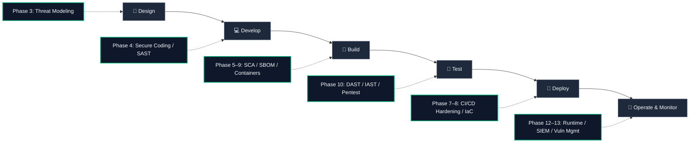
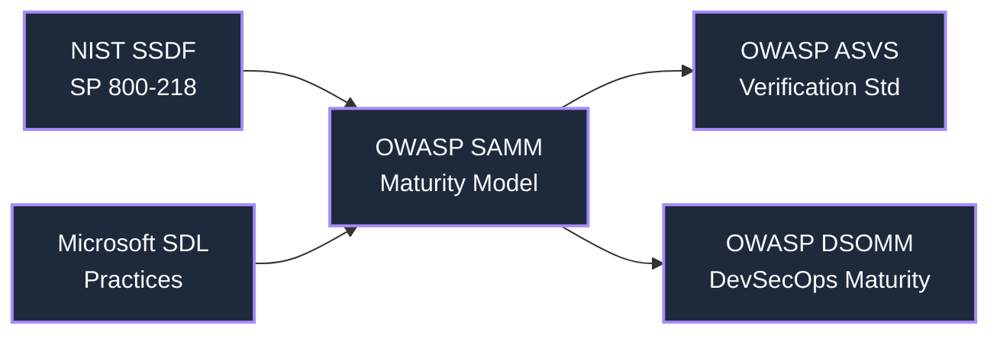
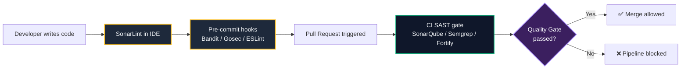
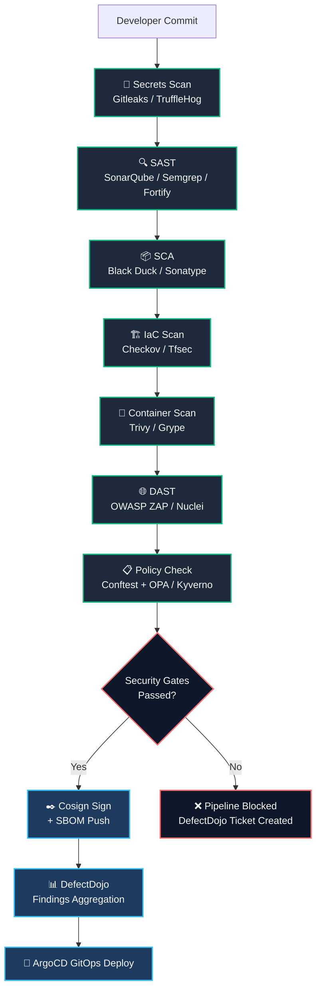
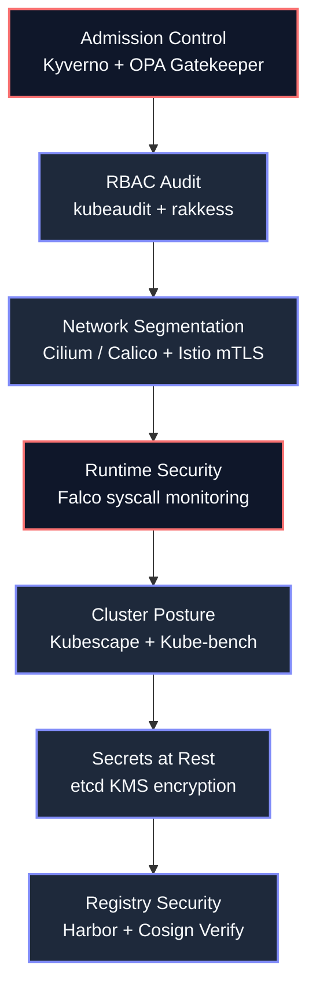
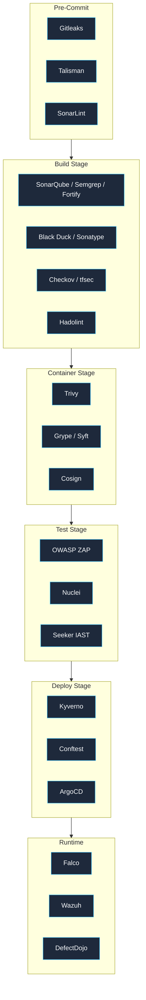
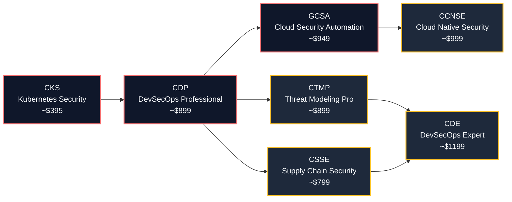

> A structured, opinionated DevSecOps roadmap covering 17 phases — from Linux fundamentals and governance frameworks through to AI/ML security and organizational leadership — synthesised from [roadmap.sh/devsecops](https://roadmap.sh/devsecops), [hahwul/DevSecOps](https://github.com/hahwul/DevSecOps), Practical DevSecOps 2026, NIST SSDF, OWASP SAMM, and real-world enterprise platform experience.

Security is no longer a gate at the end of the delivery pipeline. It is a continuous thread woven through every commit, every build, and every deployment. This roadmap defines that thread — phase by phase, tool by tool, framework by framework.

---

## 🗺️ Roadmap Overview

This roadmap is structured into **17 phases** grouped across four progression levels. It is not prescriptive — you do not need to execute every phase sequentially. Instead, use it as a navigation map: assess where you are, identify the gap, and target the phase that moves you forward.

```mermaid
flowchart TD
  classDef beginner fill:#064e3b,stroke:#10b981,stroke-width:2px,color:#f8fafc;
  classDef intermediate fill:#1e3a5f,stroke:#38bdf8,stroke-width:2px,color:#f8fafc;
  classDef advanced fill:#3b1f5f,stroke:#a78bfa,stroke-width:2px,color:#f8fafc;
  classDef expert fill:#1e1e2f,stroke:#94a3b8,stroke-width:2px,color:#f8fafc;

  P1["① Prerequisites & Foundations"]:::beginner
  P2["② SDLC, Governance & Policy"]:::beginner
  P3["③ Design & Threat Modeling"]:::beginner
  P4["④ Secure Coding & Code Review"]:::intermediate
  P5["⑤ SCA, SBOM & Supply Chain"]:::intermediate
  P6["⑥ Secrets & Credentials Mgmt"]:::intermediate
  P7["⑦ CI/CD Hardening & Pipeline Security"]:::intermediate
  P8["⑧ IaC Security & Cloud Configuration"]:::intermediate
  P9["⑨ Container & Image Security"]:::intermediate
  P10["⑩ DAST, API Security & Pentesting"]:::intermediate
  P11["⑪ Kubernetes Security & Cluster Hardening"]:::advanced
  P12["⑫ Runtime Security, SIEM & IR"]:::advanced
  P13["⑬ Vulnerability Management & Risk Tracking"]:::advanced
  P14["⑭ Zero Trust & Identity Security"]:::advanced
  P15["⑮ Software Supply Chain Assurance"]:::advanced
  P16["⑯ AI/ML Security & Emerging Threats"]:::advanced
  P17["⑰ Compliance-as-Code & Leadership"]:::expert

  P1 --> P2 --> P3 --> P4 --> P5 --> P6 --> P7 --> P8 --> P9 --> P10
  P10 --> P11 --> P12 --> P13 --> P14 --> P15 --> P16 --> P17
```

---

## 📊 DevSecOps Maturity Model

Before diving into phases, assess where your organization sits today.

| Level | Label | Description |
|:---:|:---|:---|
| **1** | Initial | Ad-hoc security, manual reviews, no pipeline automation |
| **2** | Managed | Basic SAST in CI, some SCA, growing team awareness |
| **3** | Defined | Full pipeline gates: SAST + SCA + DAST + IaC + Container scanning, DefectDojo aggregation |
| **4** | Measured | KPIs tracked, runtime security (Falco), supply chain controls (Cosign + SBOM), KSPM |
| **5** | Optimized | Full SLSA L3, zero-trust, AI-powered detection, platform golden paths, DSOMM Level 4+ |

Use [OWASP SAMM](https://owaspsamm.org/) for self-assessment across five dimensions:

- **Security Skills** — awareness, training, and expertise
- **Developer Enablement** — tooling, feedback loops, IDE integration
- **Secure Design** — threat modeling, security requirements, architecture review
- **Automated Practices** — pipeline security gates, IaC scanning, container hardening
- **Supply Chain Security** — SBOM, artifact signing, provenance, dependency governance

---

## 🏗️ The SDLC Security Integration Model

The [hahwul/DevSecOps](https://github.com/hahwul/DevSecOps) community roadmap and NIST SSDF both organize security activities by SDLC phase. Here is how the 17 roadmap phases map to the SDLC:

---

## 📐 Phase Breakdown

### Phase 1 — Prerequisites & Foundations
**Level:** Beginner · 1–2 months

Before specializing in DevSecOps, every practitioner needs mastery over the underlying technologies that DevSecOps tooling is built on.

**Key Activities:**

- Master Linux CLI: file permissions (`chmod`/`chown`), process management, networking (`ss`, `iptables`, `netstat`), user and group management
- Learn Python and/or Bash for automation: loops, functions, file I/O, API calls, subprocess
- Understand networking fundamentals: TCP/IP layers, DNS, TLS/SSL handshake, HTTP/HTTPS, proxies, load balancers
- Learn Git and SCM workflows: branching (GitFlow, trunk-based), signed commits, merge requests
- Understand containerization basics: Docker images, layers, volumes, networks, multi-stage builds
- Learn CI/CD concepts: pipeline stages, artifacts, environments, triggers, runners (GitLab CI, Jenkins, GitHub Actions)
- Study cloud fundamentals: IAM, VPC, security groups, KMS — on at least one cloud provider
- Learn cryptography basics: symmetric vs asymmetric, hashing, PKI, TLS certificates, JWT, OAuth2/OIDC
- Study **OWASP Top 10** (Web) and **OWASP API Security Top 10** — understand each vulnerability class and root cause

| Tool / Resource | Purpose |
|:---|:---|
| TryHackMe DevSecOps Path | Structured hands-on labs |
| OWASP Top 10 | Web vulnerability reference |
| Linux Journey | Linux CLI mastery |
| GitLab CI/CD Tutorial | Pipeline fundamentals |

---

### Phase 2 — SDLC, Governance & Security Policy
**Level:** Beginner · 1–2 months

Establishing the governance layer that anchors all downstream DevSecOps practices. Without this foundation, tooling becomes noise.

**Key Activities:**

- Study Secure SDLC (SSDLC): requirements, design, implementation, verification, release, response
- Align to **NIST SSDF (SP 800-218)**: four practice groups — Prepare (PO), Protect (PS), Produce (PW), Respond (RV)
- Adopt **OWASP SAMM**: assess maturity across Governance, Design, Implementation, Verification, Operations
- Use **OWASP ASVS** as baseline for application security control verification (L1 minimum, L2 for sensitive systems)
- Reference **Microsoft SDL** practices and **BSIMM** for additional governance benchmarking
- Define security policies: secure development policy, dependency policy, secrets management policy, IR policy
- Assign security roles: Security Champion per team, AppSec reviewer, vulnerability manager
- Establish KPIs: MTTD/MTTR, open critical CVEs, % pipelines with gates, SAMM maturity score
- Implement **DSOMM** alongside SAMM for DevSecOps-specific maturity measurement
- Understand compliance frameworks: PCI-DSS, ISO 27001, SOC2, GDPR, HIPAA

---

### Phase 3 — Design & Threat Modeling
**Level:** Beginner–Intermediate

Threat modeling is the highest-ROI security activity. Identifying risks before a line of code is written is orders of magnitude cheaper than finding them in production.

**Key Activities:**

- Apply **STRIDE**: Spoofing, Tampering, Repudiation, Information Disclosure, Denial of Service, Elevation of Privilege
- Apply **PASTA** (Process for Attack Simulation and Threat Analysis) for risk-centric, business-aligned modeling
- Apply **DREAD** for quantitative risk scoring: Damage, Reproducibility, Exploitability, Affected Users, Discoverability
- Use **MITRE ATT&CK** to map attack paths and TTPs to architecture diagrams
- Build Data Flow Diagrams (DFDs) with trust boundaries, data stores, external entities, and processes
- Use **IRIS Risk** for structured risk quantification, attack path analysis, and scored threat catalogs
- Use **OWASP Threat Dragon** for visual DFD-based threat modeling and client report generation
- Use **Threagile** for Agile-friendly threat modeling as code (YAML-based, GitOps-compatible)
- Derive security requirements from threat model outputs; map to OWASP ASVS controls
- Conduct security design reviews for every major feature, microservice, or architectural change
- Apply abuse case / misuse case analysis alongside use case development in sprint planning

| Tool | Type | Purpose |
|:---|:---|:---|
| OWASP Threat Dragon | OSS | DFD-based visual threat modeling |
| IRIS Risk | OSS | Quantified risk scoring |
| Threagile | OSS | Threat modeling as code (YAML) |
| Microsoft Threat Modeling Tool | Free | STRIDE-based analysis |

---

### Phase 4 — Secure Coding & Code Review
**Level:** Intermediate · 2–4 months

Embedding security into the development phase through language-specific guidelines, SAST tooling, pre-commit hooks, and structured peer review.

**Key Activities:**

- Adopt language-specific secure coding guides: OWASP SCP, Oracle Java SE Guide, OWASP Go-SCP, Rails Security Guide
- Prevent OWASP Top 10 at code level: parameterized queries, output encoding, CSRF tokens, input validation
- Integrate SAST in pull requests: **SonarQube** Quality Gates, **Semgrep** custom rules, **Fortify SCA**, **CodeQL** semantic analysis
- Configure IDE-level feedback with **SonarLint** in VS Code and IntelliJ — catch issues before commit
- Set up pre-commit hooks: **Bandit** (Python), **Gosec** (Go), **Njsscan** (Node.js), **ESLint** security plugins
- Conduct structured secure code review: trust boundaries, data flow, auth/authz logic, deserialization, cryptography
- Use **Semgrep** for custom rules targeting proprietary frameworks and business logic anti-patterns
- Implement peer review checklists aligned with OWASP ASVS controls
- Use AI-powered SAST remediation (**Corgea**) to auto-generate fix PRs from Fortify/Semgrep findings

---

### Phase 5 — SCA, SBOM & Software Supply Chain
**Level:** Intermediate

Managing open-source component risk across the entire dependency graph — from language packages to container base images.

**Key Activities:**

- Implement SCA for all ecosystems: `npm audit`, `pip-audit`, Maven, Gradle, `composer audit`, Bundler, Go modules
- Use **Black Duck** + **Sonatype Nexus IQ** for enterprise SCA — enforce policy gates blocking builds in CI
- Enforce dependency version pinning: lockfiles (`package-lock.json`, `poetry.lock`, pip hashes) in all repositories
- Define and enforce license policy: block GPL in proprietary products, flag LGPL for legal review
- Scan for malicious/typosquatted packages with **Coana/Socket.dev** before they enter the build
- Automate dependency updates with **Renovate** or **Dependabot** — prevent CVE accumulation in long-lived branches
- Generate SBOMs at every build: **Syft** → CycloneDX format → push to **Dependency-Track** for continuous monitoring
- Sign all container images with **Cosign/Sigstore**; verify at ArgoCD deploy time via Kyverno `imageVerify` policy
- Target **SLSA Level 3** via Tekton Chains: isolated builds, signed provenance, Rekor transparency log
- Generate **VEX** (Vulnerability Exploitability eXchange) documents alongside SBOMs
- Run **OpenSSF Scorecard** periodically on all repositories

| Component | Tool | Purpose |
|:---|:---|:---|
| Enterprise SCA | Black Duck + Sonatype | Policy gates, license compliance |
| Lightweight SCA | OSV-Scanner + Grype | CI complement |
| SBOM Generation | Syft → CycloneDX | Build-time SBOM |
| SBOM Monitoring | Dependency-Track | Continuous CVE monitoring |
| Artifact Signing | Cosign + Sigstore | Supply chain integrity |
| Supply Chain Levels | SLSA L3 via Tekton Chains | Provenance enforcement |
| Repo Posture | OpenSSF Scorecard | Branch protection, signed commits |

---

### Phase 6 — Secrets & Credentials Management
**Level:** Intermediate

Hardcoded credentials are the single most common root cause of production breaches. This phase eliminates them — at the developer's workstation, in git history, and in running infrastructure.

**Key Activities:**

- Install pre-commit secrets hooks on all developer machines: **Gitleaks** and/or **Talisman**
- Scan full git history with **TruffleHog** — 700+ credential detectors with live API verification
- Monitor all org repositories in real-time with **GitGuardian** or **Semgrep Secrets**
- Deploy **HashiCorp Vault** as the secrets backbone: dynamic DB secrets, PKI for mTLS certs, K8s Agent/CSI injection
- Use **External Secrets Operator (ESO)** to sync Vault/AWS/Azure secrets into Kubernetes natively
- Implement dynamic secrets: database credentials with auto-rotation, AWS STS temporary credentials
- Never store secrets in: container images, ENV vars at rest, `.env` files committed to VCS, pipeline YAML variables
- Ship Vault audit logs to SIEM for anomalous access pattern detection

> **The Golden Rule:** If a secret was ever committed to version control — even for one second — assume it is compromised and rotate it immediately.

---

### Phase 7 — CI/CD Hardening & Pipeline Security
**Level:** Intermediate–Advanced

The pipeline is itself an attack surface. Compromising a CI/CD system gives an attacker write access to every application it deploys. Treat it accordingly.

**Key Activities:**

- Apply least privilege to all pipeline service accounts: Tekton ServiceAccounts, Jenkins agents, GitLab CI runners
- Pin all pipeline task/action versions to specific commit SHAs — never use floating mutable tags
- Isolate pipeline runners: ephemeral containers, separate K8s namespaces, no persistent state between runs
- Implement full security gate sequence: Secrets → SAST → SCA → IaC scan → Container scan → DAST → Policy check → Sign
- Integrate **DefectDojo** as central finding aggregator: all scanner outputs (SARIF/JSON/XML) → unified SLA dashboard
- Enforce Quality Gates: block on Critical/High findings; require formal exception sign-off for accepted risks
- Use **Conftest** + OPA Rego to validate K8s manifests, Helm charts, and Terraform before apply
- Use **Kyverno** to verify Cosign image signatures at admission — block unsigned images
- Audit CI/CD platform configuration with **Legitify**: GitLab branch protection, webhook secrets, runner security
- Harden Jenkins: disable Script Console, use Credentials Store, enable audit logging, enforce CSP headers
- Enforce separation of pipeline trust levels: dev → staging (DAST runs) → prod (signed artifacts only)

---

### Phase 8 — IaC Security & Cloud Configuration
**Level:** Intermediate–Advanced

If infrastructure is code, then insecure infrastructure is insecure code. Scan it before it is applied.

**Key Activities:**

- Scan all Terraform code with **Checkov** (1000+ policies) and **tfsec/Trivy IaC** before every `terraform plan/apply`
- Scan Kubernetes YAML manifests with **KubeLinter** and **Kubesec** risk scoring before `kubectl apply`
- Scan Dockerfiles with **Hadolint** against CIS Docker Benchmark: non-root USER, pinned base images, no secrets in layers
- Scan CloudFormation (AWS), ARM/Bicep (Azure), and GCP Deployment Manager with Checkov
- Use **Terraform Sentinel** for enterprise policy governance in Terraform Cloud/Enterprise environments
- Implement **Compliance-as-Code** with OPA: encode PCI-DSS controls, ISO 27001 clauses, CIS Controls as Rego policies
- Audit cloud configuration with **CloudSploit** and **Scout Suite**: exposed resources, permissive IAM, unencrypted data
- Enforce least-privilege IAM: no wildcard `*` permissions, separate IAM roles per workload
- Implement cloud drift detection: alert when live infrastructure diverges from IaC definitions
- Validate **Ansible** playbooks and roles for security hardening: idempotent CIS benchmark role application

---

### Phase 9 — Container & Image Security
**Level:** Intermediate–Advanced

Securing the full container lifecycle — from Dockerfile authoring through registry storage to running workload in production.

**Key Activities:**

- Scan images in CI with **Trivy** (primary) and **Grype** (SBOM-first): block on Critical/High CVEs before registry push
- Build minimal base images: distroless or Alpine, multi-stage builds, remove build tools from final layer
- Enforce non-root containers: `USER` directive in Dockerfile, `runAsNonRoot: true` in K8s SecurityContext
- Enable read-only root filesystems: `readOnlyRootFilesystem: true` in K8s pod specs
- Drop all Linux capabilities; add back only those explicitly required (e.g., `NET_BIND_SERVICE`)
- Apply **AppArmor** profiles or **Seccomp** profiles for syscall restriction
- Sign all images with **Cosign**; verify at K8s admission via Kyverno `imageVerify` policy
- Generate SBOM (Syft → CycloneDX) alongside every image build; ingest into Dependency-Track
- Deploy **Trivy Operator** in-cluster for continuous rescanning of running workloads
- Enforce tag immutability and content trust in **Harbor** registry

| Threat | Control |
|:---|:---|
| Vulnerable base image OS packages | Trivy + Grype CI gate |
| Running as root | Dockerfile USER + K8s SecurityContext |
| Tampered image | Cosign signing + Kyverno verification |
| New CVEs in deployed images | Trivy Operator (in-cluster continuous scan) |
| Insecure Dockerfile | Hadolint + CIS Docker Benchmark |

---

### Phase 10 — DAST, API Security & Pentesting
**Level:** Intermediate–Advanced

Testing running applications dynamically — automated DAST in CI/CD, API-specific security testing, TLS validation, and periodic professional penetration testing.

**Key Activities:**

- Run **OWASP ZAP** automated CI mode (Full Scan / API Scan) against staging environments
- Use **Dastardly** (free Burp-based) for CI-native DAST without a full Burp Enterprise license
- Use **Burp Suite Professional** for manual penetration testing and OAST via Burp Collaborator
- Implement **Nuclei** for CVE-specific template scanning (9000+ templates) in scheduled periodic pipelines
- Validate TLS/SSL with **SSLyze** across all ingress endpoints: weak ciphers, expired certs, HSTS gaps
- Test REST API security with **Escape/Akto**: BOLA, injection, business logic flaws, shadow API discovery
- Test GraphQL APIs with **Escape**: introspection abuse, deeply nested queries, authorization bypass
- Use **Katana** for JavaScript-heavy SPA crawling before DAST scanning
- Implement **IAST** (**Seeker**, **Contrast Security**) for runtime detection during QA/functional testing
- Apply **OWASP Web Security Testing Guide (WSTG)** as the authoritative methodology for manual testing
- Track all DAST and pentest findings in **DefectDojo**; enforce SLA on critical findings

---

### Phase 11 — Kubernetes Security & Cluster Hardening
**Level:** Advanced · 6+ months

Hardening multi-cluster Kubernetes environments across the full attack surface — API server, nodes, workloads, network, RBAC, runtime, and supply chain.

**Key Activities:**

- Apply **CIS Kubernetes Benchmark** with **Kube-bench**: API server flags, kubelet config, etcd permissions
- Run continuous KSPM with **Kubescape**: NSA/CISA Hardening Guide, CIS Benchmark, MITRE ATT&CK for Containers
- Implement RBAC least-privilege: audit with **kubeaudit** and **rakkess** (access matrix); remove all `cluster-admin` bindings
- Enforce **Kubernetes Pod Security Standards** (Baseline/Restricted) via PSS or OPA Gatekeeper
- Deploy **Kyverno**: require Cosign-signed images, enforce non-root containers, block `hostNetwork`/`hostPID`/`hostIPC`
- Use **OPA Gatekeeper** for complex cross-resource Rego policies: registry allowlists, label mandates
- Implement network micro-segmentation with **Cilium** (eBPF, L7 policies) or **Calico** (BGP, WireGuard encryption)
- Deploy **Istio** service mesh: mTLS east-west encryption, JWT/OIDC AuthN/AuthZ, L7 observability
- Encrypt etcd at rest with KMS provider: Vault KMS plugin or cloud-native KMS
- Enable K8s API server audit logging; ship to SIEM; alert on `exec`/`create`/`delete` in sensitive namespaces
- Deploy **Trivy Operator** in-cluster for continuous image rescanning with Prometheus metrics

---

### Phase 12 — Runtime Security, SIEM & Incident Response
**Level:** Advanced

Detecting and responding to threats in running environments — from syscall-level container monitoring to enterprise SIEM correlation and incident playbooks.

**Key Activities:**

- Deploy **Falco** for runtime syscall threat detection: shell spawning, privilege escalation, unexpected network connections
- Configure **Falcosidekick**: route Falco alerts → Slack, PagerDuty, SIEM, DefectDojo
- Implement **RASP** (Contrast Security agents) for JVM, .NET, Node.js apps in production
- Deploy **Wazuh** as HIDS on K8s nodes, VMs, and RHEL hosts: FIM, log analysis, CIS compliance
- Build K8s security dashboards in **Prometheus + Grafana**: Falco alert trends, policy violations, CVE counts
- Use **OSQuery** for SQL-based host forensics: query processes, sockets, kernel modules, file events
- Centralize logs in **ELK Stack** or **Graylog**: K8s audit logs, Falco events, scanner outputs
- Deploy **Splunk** or **Microsoft Sentinel** for enterprise SIEM with ML-based anomaly detection
- Enable K8s API server audit logging with AlertManager rules for anomalous operations
- Establish incident response playbooks: detection → triage → containment → eradication → recovery → postmortem
- Conduct tabletop exercises and chaos engineering to validate detection and response capabilities

---

### Phase 13 — Vulnerability Management & Risk Tracking
**Level:** Advanced

Centralizing, triaging, and tracking all security findings with SLA enforcement and risk-based prioritization.

**Key Activities:**

- Use **DefectDojo** as central vuln management: ingest SAST, DAST, SCA, IaC, container scan results from all tools
- Configure deduplication and false-positive management in DefectDojo across 150+ scanner integrations
- Define SLA policies by severity: Critical 24h, High 7d, Medium 30d, Low 90d — enforce in DefectDojo
- Use **Fortify SSC** for enterprise Fortify SAST/DAST/WebInspect finding management
- Use **Synopsys SRM** for aggregating Coverity + Black Duck + Seeker findings into unified risk scoring
- Use **CVSS v3.1/v4.0** for severity scoring; apply **EPSS** for prioritization by exploit probability
- Generate compliance evidence reports: OWASP ASVS attestation, CIS Benchmark reports, SAMM exports
- Build executive dashboards: vuln trend over time, open vs closed by severity, SLA adherence
- Integrate DefectDojo → Jira: auto-create tickets for Critical/High findings

---

### Phase 14 — Zero Trust Architecture & Identity Security
**Level:** Advanced

Never trust, always verify — micro-segmentation, mTLS, workload identity, and least-privilege access across all boundaries.

**Key Activities:**

- Implement **Zero Trust Architecture** per NIST SP 800-207: explicit verification, least privilege, assume breach
- Enforce micro-segmentation: Cilium L7 NetworkPolicies, Istio `AuthorizationPolicies` for every service pair
- Implement mTLS for all service-to-service communication within Kubernetes via Istio
- Enforce JWT/OIDC-based authentication at the service mesh layer (`RequestAuthentication` policies)
- Apply least-privilege RBAC: K8s RBAC, cloud IAM, Vault policies, CI/CD service accounts
- Implement workload identity with **SPIFFE/SPIRE**: cryptographic identities for workloads, no long-lived secrets
- Use Vault for dynamic privileged credentials; **CyberArk** for enterprise PAM
- Enforce developer access via PKI-based SSH (Vault SSH Secrets Engine) or VPN with MFA/OIDC
- Run quarterly RBAC audits with `rakkess` to surface over-permissioned ServiceAccounts

---

### Phase 15 — Software Supply Chain Assurance
**Level:** Advanced

End-to-end supply chain security — build provenance, hermetic builds, artifact signing, transparency logs, and SLSA Level 3 enforcement.

**Key Activities:**

- Enforce **SLSA Level 3+** via Tekton Chains: isolated ephemeral builds, signed provenance pushed to Rekor
- Sign all container images and SBOMs with Cosign; verify at K8s admission and ArgoCD sync
- Implement hermetic builds: no external network calls during build, pin all tool versions, reproducible outputs
- Run **OpenSSF Scorecard** on all repos; enforce minimum score threshold in CI as a compliance gate
- Monitor ingested SBOMs in **Dependency-Track**; auto-alert when new CVEs match deployed components
- Implement NIST SSDF supply chain controls: PO.3 (maintain provenance), PS.2 (protect build envs), PW.4 (verify 3rd-party)
- Generate **VEX** documents alongside SBOMs — provide CVE exploitability context for downstream consumers
- Harden pipeline infrastructure: ephemeral runners, no standing access, signed task definitions

---

### Phase 16 — AI/ML Security & Emerging Threats
**Level:** Advanced–Expert · 2026+

The newest and fastest-growing attack surface in 2026. AI/ML systems introduce fundamentally new threat models that traditional AppSec tooling was not designed for.

**Key Activities:**

- Study **OWASP LLM Top 10**: prompt injection, insecure output handling, training data poisoning, model theft, supply chain vulnerabilities
- Study **MITRE ATLAS**: adversarial threat landscape for AI — model evasion, inference attacks, data poisoning
- Secure AI/ML training pipelines: integrity of training data, model provenance, signed model artifacts
- Scan AI/ML dependencies and model registries for supply chain risks: poisoned models from HuggingFace, malicious PyPI
- Perform AI-specific threat modeling: LLM integration attack trees, agent tool poisoning, MCP server vulnerabilities
- Test **MCP (Model Context Protocol)** servers for tool poisoning, prompt injection, and cross-agent supply chain attacks
- Secure RAG architectures: access control on vector databases, data leakage prevention, prompt isolation
- Implement **EU AI Act** compliance: risk classification, conformity assessment, documentation requirements
- Align to **ISO/IEC 42001** for organizational AI governance

| Threat Category | Framework / Reference |
|:---|:---|
| LLM Application Security | OWASP LLM Top 10 |
| AI Adversarial Attacks | MITRE ATLAS |
| AI Supply Chain | OWASP AI Exchange |
| Regulatory Compliance | EU AI Act + ISO/IEC 42001 |

---

### Phase 17 — Compliance-as-Code, Maturity & Leadership
**Level:** Expert · 12+ months

Driving organizational DevSecOps transformation — compliance automation, golden paths, Security Champions, and continuous maturity improvement.

**Key Activities:**

- Run **OWASP SAMM** self-assessment annually; maintain improvement trend documentation
- Implement **Compliance-as-Code** with OPA: encode PCI-DSS, ISO 27001, CIS Controls v8 as Rego policies
- Build **golden path platform templates**: secure-by-default pipelines, pre-approved base images, configured toolchain
- Establish a **Security Champions program**: one champion per development team, security training, escalation pathway
- Implement DevSecOps metrics: MTTD, MTTR, % repos with SAST, SBOM coverage %, open critical CVE age
- Lead knowledge transfer sessions: Fortify SSC for AppSec teams, DefectDojo for vulnerability managers
- Pursue expert certifications: **CKS**, **GCSA**, **CDP/CDE**, **CTMP**, **CSSE**
- Contribute to OWASP projects and community DevSecOps roadmaps
- Stay current: shift-smart security, post-quantum cryptography, AI security automation, eBPF security

---

## 🛡️ Security Tools Reference

### By Pipeline Stage

### By Category

| Category | OSS Tools | Enterprise Tools |
|:---|:---|:---|
| **SAST** | SonarQube, Semgrep, CodeQL, Bandit, Gosec | Fortify SCA, Checkmarx, Veracode, Coverity |
| **SCA** | OSV-Scanner, Grype, Dependency-Check | Black Duck, Sonatype Nexus IQ, Snyk |
| **DAST** | OWASP ZAP, Nuclei, Nikto, Dastardly | Burp Suite, Invicti, Escape |
| **Container** | Trivy, Grype, Clair, Hadolint | Anchore Enterprise, Docker Scout |
| **Secrets** | Gitleaks, TruffleHog, Detect-Secrets | GitGuardian, Semgrep Secrets |
| **IaC** | Checkov, tfsec, KubeLinter, Kubesec | Bridgecrew, Terraform Sentinel |
| **K8s Posture** | Kube-bench, Kubescape, kubeaudit, rakkess | Prisma Cloud, Sysdig Secure |
| **Runtime** | Falco, Wazuh, OSQuery | Contrast (RASP), Sysdig |
| **Vuln Mgmt** | DefectDojo, Dependency-Track | Fortify SSC, Synopsys SRM |
| **Secrets Mgmt** | HashiCorp Vault, Infisical | CyberArk, Doppler |
| **SBOM/Signing** | Syft, Cosign, CycloneDX | Anchore Enterprise |
| **Supply Chain** | OpenSSF Scorecard, Tekton Chains | Prisma Cloud |

---

## 📚 Core Frameworks & Standards

| Framework | Focus | Why It Matters |
|:---|:---|:---|
| **NIST SSDF (SP 800-218)** | Secure software development practices | Vendor-neutral backbone for all roadmap phases |
| **OWASP SAMM** | Maturity model for software assurance | Self-assessment and improvement planning |
| **OWASP ASVS** | Application security verification | Control baseline for design, code, and runtime |
| **SLSA Framework** | Artifact provenance and supply chain levels | Directly relevant to Cosign + Tekton Chains work |
| **OpenSSF Scorecard** | Automated repo security posture | Continuous supply chain health measurement |
| **OWASP DSOMM** | DevSecOps-specific maturity model | Pipeline-focused assessment dimensions |
| **CIS K8s Benchmark** | Kubernetes hardening standards | Kube-bench compliance target |
| **NSA/CISA K8s Guide** | K8s hardening for government/enterprise | Kubescape framework target |
| **NIST SP 800-207** | Zero Trust Architecture | Phase 14 implementation reference |
| **OWASP LLM Top 10** | LLM application security | Phase 16 AI security reference |
| **MITRE ATT&CK** | Adversarial tactics and techniques | Kubescape, Falco, and threat modeling |

---

## 🎓 Certifications & Learning Path

### Recommended Certification Path

### Key Learning Resources

**Free / OWASP:**
- [OWASP Developer Guide](https://owasp.org/www-project-developer-guide/) — Security fundamentals, secure development, integration standards
- [OWASP Cheat Sheet Series](https://cheatsheetseries.owasp.org/) — Deep-dive per vulnerability class
- [OWASP SAMM Self-Assessment](https://owaspsamm.org/assessment/) — Measure your current maturity baseline
- [TryHackMe DevSecOps Path](https://tryhackme.com/path/outline/devsecops) — Structured hands-on labs

**Community Curated:**
- [hahwul/DevSecOps](https://github.com/hahwul/DevSecOps) — Community roadmap with resources by SDLC phase
- [TaptuIT Awesome DevSecOps](https://github.com/TaptuIT/awesome-devsecops) — Comprehensive tool and resource list
- [Hysnsec Awesome Threat Modelling](https://github.com/hysnsec/awesome-threat-modelling) — Threat modeling books, tools, workshops
- [Hysnsec Awesome Policy-as-Code](https://github.com/hysnsec/awesome-policy-as-code) — OPA, Rego, Kyverno resources

**Platform / Vendor:**
- [roadmap.sh/devsecops](https://roadmap.sh/devsecops) — Community DevSecOps roadmap
- [Practical DevSecOps Blog](https://www.practical-devsecops.com/blog/) — 2026 practices and trends
- [NIST SSDF SP 800-218](https://csrc.nist.gov/publications/detail/sp/800-218/final) — Official SSDF standard

---

## 🔭 2026 Trends to Watch

The DevSecOps landscape is moving fast. Here are the areas demanding attention beyond traditional tooling:

*  **Shift-Smart Security** — Moving beyond "shift-left" to contextual, risk-based security that prioritizes findings by exploitability (EPSS), reachability (QwietAI), and business impact. Stop alert flooding, start smart gating.

*  **AI/ML Attack Surfaces** — OWASP LLM Top 10, MITRE ATLAS, and MCP server security are now first-class concerns as AI is embedded in every engineering workflow. Prompt injection and model supply chain attacks are real and growing.

*  **Post-Quantum Cryptography (PQC)** — NIST has finalized PQC standards (ML-KEM, ML-DSA). Begin inventory of cryptographic assets and plan migration timelines for long-lived keys and certificates.

*  **eBPF Security** — Tools like Cilium, Tetragon, and Falco leveraging eBPF are delivering unprecedented kernel-level visibility with minimal overhead. eBPF is becoming the foundation of the next generation of runtime security tooling.

*  **Platform Engineering × Security** — Security teams are becoming platform teams, providing "golden paths" — secure-by-default developer templates that reduce cognitive load while embedding controls automatically.

*  **Software Bill of Materials (SBOM) Mandates** — Regulatory pressure (US Executive Order 14028, EU CRA) is making SBOMs mandatory for software sold to government and critical infrastructure sectors.

---

## 💭 Key Takeaways

*  **DevSecOps is a culture, not just a toolchain.** The tools enable the practice; the practice requires organizational commitment.

*  **Shift-left has a limit.** Catching issues early is essential — but so is having runtime detection, supply chain controls, and incident response capabilities. Security in depth across all 17 phases is the goal.

*  **Security gates must enforce, not advise.** Advisory scanners breed alert fatigue. CRITICAL-severity blocks that stop pipeline execution are what change developer behavior.

*  **Every artifact needs a verified provenance chain.** From source commit to deployed container, every step should be cryptographically verifiable. This is the core principle behind SLSA, Cosign, and Tekton Chains.

*  **Maturity is iterative.** No organization moves from Level 1 to Level 5 in one sprint. Use OWASP SAMM self-assessment quarterly, define one concrete improvement per domain per quarter, and measure progress consistently.

---

## 🔗 References & Further Reading

| Resource | Link |
|:---|:---|
| NIST SSDF SP 800-218 | [csrc.nist.gov](https://csrc.nist.gov/publications/detail/sp/800-218/final) |
| OWASP SAMM | [owaspsamm.org](https://owaspsamm.org/) |
| OWASP ASVS | [owasp.org/www-project-asvs](https://owasp.org/www-project-application-security-verification-standard/) |
| OWASP DSOMM | [owasp.org/www-project-dsomm](https://owasp.org/www-project-devsecops-maturity-model/) |
| OWASP DevSecOps Guideline | [owasp.org/www-project-devsecops-guideline](https://owasp.org/www-project-devsecops-guideline/) |
| SLSA Framework | [slsa.dev](https://slsa.dev/) |
| OpenSSF Scorecard | [scorecard.dev](https://scorecard.dev/) |
| roadmap.sh/devsecops | [roadmap.sh/devsecops](https://roadmap.sh/devsecops) |
| hahwul/DevSecOps | [github.com/hahwul/DevSecOps](https://github.com/hahwul/DevSecOps) |
| Practical DevSecOps 2026 | [practical-devsecops.com](https://www.practical-devsecops.com/devsecops-roadmap/) |
| MITRE ATT&CK for Containers | [attack.mitre.org](https://attack.mitre.org/matrices/enterprise/containers/) |
| OWASP LLM Top 10 | [owasp.org/www-project-top-10-llm](https://owasp.org/www-project-top-10-for-large-language-model-applications/) |
| CIS K8s Benchmark | [cisecurity.org](https://www.cisecurity.org/benchmark/kubernetes) |
| NSA/CISA K8s Hardening Guide | [media.defense.gov](https://media.defense.gov/2022/Aug/29/2003066362/-1/-1/0/CTR_KUBERNETES_HARDENING_GUIDANCE_1.2_20220829.PDF) |
| DevSecOps Trends 2026 | [practical-devsecops.com/devsecops-trends-2026](https://www.practical-devsecops.com/devsecops-trends-2026/) |

---

## 🙌 Connect

I hope this roadmap serves as a useful navigation map for your DevSecOps journey — whether you are building a new platform from scratch, maturing an existing pipeline, or leading a security transformation at an enterprise client.

Feedback, suggestions, and collaboration ideas are always welcome. Let's keep building secure software together.

**🔗 Connect with me:**

- [LinkedIn](https://www.linkedin.com/in/hossamibraheem/)
- [GitHub](https://github.com/0x70ssAM)
- [Blog](https://0x70ssam.github.io)
